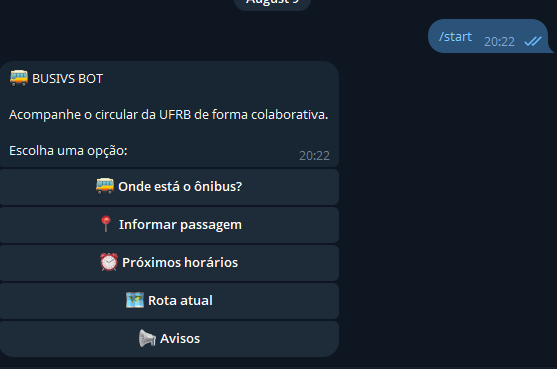

# BUSIVS BOT 🚌

Bot comunitário para auxiliar estudantes da **UFRB - Campus Cruz das Almas** a consultar horários do circular e acompanhar sua situação de forma simples e colaborativa.

> **Status atual:** protótipo funcional rodando via Telegram.

---

## O que é o BUSIVS BOT?

O BUSIVS BOT nasceu para responder perguntas simples que fazem parte da rotina de quem depende do circular:

- Qual é o próximo horário?
- Existe uma volta acontecendo agora?
- Onde o ônibus foi visto por último?
- Qual é o próximo ponto?
- Ele está indo para a Rua ou retornando?
- Ele provavelmente já está na Garagem?

O objetivo não é substituir GPS em tempo real.

A proposta é usar os **horários oficiais** junto com a **colaboração dos próprios estudantes** para oferecer uma informação útil, rápida e acessível pelo Telegram.

---

## Interface

O Telegram é toda a interface do projeto.

Não é necessário instalar outro aplicativo ou acessar um site separado.



Menu atual:

```text
🚌 Onde está o ônibus?
📍 Informar passagem
⏰ Próximos horários
📋 Listar horários
🗺️ Rota atual
📢 Avisos
```

---

# O que já funciona

## ⏰ Consultar horários

O bot informa:

- próxima viagem;
- viagem seguinte;
- horários por período;
- origem da saída;
- previsão aproximada de passagem pelo Portão 1;
- viagem possivelmente em andamento.

Exemplo:

```text
🚌 VOLTA POSSIVELMENTE EM ANDAMENTO
🅿️ 10:00  Garagem ➡️ RUA
   ↪️ Retorno Portão 1: 10:15–10:20

🟢 PRÓXIMA VIAGEM
🅿️ 11:30  Garagem ➡️ RUA
```

---

## 📍 Colaboração dos estudantes

O BUSIVS depende da colaboração da comunidade para tornar a informação mais útil.

Quando um aluno vê o ônibus passar, pode tocar em **📍 Informar passagem** e selecionar o ponto correspondente.

Quanto mais estudantes colaborarem, mais útil tende a ser a informação exibida para quem está esperando o circular.

---

## 🚌 Onde está o ônibus?

O bot combina horário previsto e informações recebidas durante o percurso.

Quando existe uma confirmação recente, pode mostrar algo como:

```text
📍 Última confirmação: Ponto Externo I / Alex
🕐 agora mesmo (10:20:49)

⏭️ Próximo:
     📍 Ponto Externo II / Canãa
➡️ Sentido: RUA
```

Quando ainda não existe confirmação, o sistema pode usar o horário previsto como referência:

```text
🚌 Pelo horário oficial, o ônibus deve ter saído da Garagem às 10:00.
➡️ Sentido provável: RUA

ℹ️ Informação baseada apenas no horário previsto, não em confirmação real.
```

O bot sempre tenta deixar claro quando uma informação é apenas uma estimativa.

---

## ↩️ Percurso de retorno

Depois da passagem esperada pelo Portão 1, o sistema pode indicar que o ônibus provavelmente está fazendo o percurso de retorno.

```text
↩️ Percurso de retorno
🚌 Pelo horário, o ônibus provavelmente está no percurso de retorno.
⬅️ Sentido: Garagem
📍 O ônibus ainda segue atendendo pontos durante esse percurso.
```

Isso é importante porque estar no retorno **não significa que o ônibus deixou de atender os pontos da rota**.

---

## 🅿️ Provavelmente na Garagem

Quando o percurso anterior provavelmente já terminou e ainda falta tempo para a próxima saída, o bot pode mostrar:

```text
🅿️ Provavelmente na Garagem

🚌 Pelo horário, o ônibus provavelmente já concluiu o percurso anterior.

⏰ Próxima saída prevista:
     🕐 11:30 — Garagem
```

Dessa forma, o aluno consegue saber não apenas que não há uma volta ativa, mas também quando deve acontecer a próxima saída.

---

## ⚠️ Possível atraso

O protótipo já possui uma primeira lógica experimental para indicar possível atraso no Portão 1.

Quando a posição conhecida do ônibus não combina com o horário esperado, o sistema pode mostrar:

```text
⚠️ Possível atraso no Portão 1
🚪 Passagem esperada por volta de 10:20.
ℹ️ É uma estimativa, não uma confirmação de atraso.
```

Essa funcionalidade ainda será refinada com o uso real do projeto.

---

# Rota cadastrada

```text
RU / Residências
↓
Fitotecnia
↓
Prédio de Solos / NEAS / Eng. Florestal
↓
Pavilhão de Aulas I
↓
Biblioteca
↓
Pavilhão de Aulas II
↓
Pavilhão de Engenharia (opcional)
↓
Portão 2 / Tabela
↓
Ponto Externo I / Alex
↓
Ponto Externo II / Canãa
↓
Portão 1
↓
Biblioteca
↓
Torre / COTEC (opcional)
↓
RU / Residências
```

Os pontos opcionais são atendidos quando houver necessidade de desembarque.

---

# Como o sistema funciona

A ideia é propositalmente simples:

```text
Horários oficiais
       +
colaboração dos alunos
       ↓
BUSIVS BOT
       ↓
Telegram
```

O sistema não possui GPS próprio.

Por isso existem dois tipos de informação:

- **confirmação de passagem** — informação recebida durante o percurso;
- **estimativa** — informação calculada a partir do horário previsto.

Sempre que possível, o bot deixa essa diferença explícita.

---

# Por que Telegram?

O projeto utiliza o Telegram porque permite:

- acesso rápido pelo celular;
- botões simples;
- nenhum frontend separado;
- baixo custo de operação;
- facilidade para estudantes colaborarem;
- possibilidade futura de integração com tags NFC nos pontos.

---

# Tecnologias

O protótipo atual usa:

- Python
- Telegram Bot API
- `python-telegram-bot`
- `python-dotenv`
- arquivos JSON

A arquitetura foi mantida pequena de propósito para que o projeto continue barato e fácil de manter.

---

# Próximos passos

O projeto ainda deve evoluir com recursos como:

- suporte ao Micro-ônibus;
- tags NFC nos pontos;
- tratamento de desvios dos portões;
- modo de férias;
- refinamento das estimativas com dados reais;
- avisos de atraso;
- possíveis notificações para usuários interessados.

---

# Status do projeto

```text
Base do bot                              ✅
Horários fixos do Principal             ✅
Pontos / rota / sentido / próximo ponto ✅
Informar passagem                       ✅ protótipo
Localização / tempo / estados           ✅ protótipo validado
Principal + Micro                       ⏭️ próxima etapa
NFC                                     ⏳
Desvios dos portões                     ⏳
Modo de férias                          ⏳
Avisos e alertas                        ⏳
```

---

# Documentação técnica

Para quem deseja estudar, desenvolver ou continuar o projeto:

- [Continuidade e guia técnico](CONTINUIDADE.md)
- [Fluxo do Telegram](docs/FLUXO_TELEGRAM.md)
- [Roadmap até Beta](docs/ROADMAP_BETA.md)
- [Arquitetura](docs/ARQUITETURA.md)

---

## BUSIVS BOT

Um projeto simples com uma ideia simples:

> **usar colaboração e informação para diminuir a incerteza de quem está esperando o circular.**
